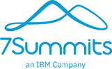

# 7Summits Technical Exercise

## Interview Options:

a) Submit the location of a Git repository of code you have developed. This code should be representative of the work that you typically do. It can be work that you've done in preparation for a Trailhead superbadge or some personal project you have worked on. Do not submit proprietary code (e.g. code that belongs to a partciular company).

**-- or --**

b) Complete the exercise below. 

Whichever option you chose, ensure that the repo you submit is accessible to the interviewers. Your recruiter will provide you with the email addresses of the interviewers for this access.

## Exercise Instructions

This exercise is meant to simulate the type of activity you would perform as a developer on a project. This includes:

- Developing new functionality based on a technical specification.
- Updating existing functionality based on an error or bug that has been reported.

Please plan on spending no more than **1 hour** on the exercise. 

### Scenario
Create a trigger and handler class that updates a Contact's mailing address whenever the related User record changes their street address. Make sure to create unit tests for all your code. You will need to have a community enabled to complete this exercise.

### How to enable communities:
- From Setup, enter Digital Experiences in the Quick Find box, then select Digital Experiences | Settings.
- Select Enable Digital Experiences.
- If enhanced domains are enabled in your org, your digital experiences domain is shown. It includes your My Domain name in the format MyDomainName.my.site.com for production orgs.
- If enhanced domains aren’t enabled in your org, select a domain name, and click Check Availability to make sure that it’s not already in use.
- Refer to this help article https://help.salesforce.com/articleView?id=networks_enable.htm&type=5

### How to create a community user:
- From an account record view or add the contact record for the person you want to add to a community.
- On the contact detail page, click the actions dropdown and select Enable Partner User or Enable Customer User. This option creates a user record in your Salesforce org with some details prepopulated from the contact record.
- Edit the user record for this external user and assign the appropriate user license: Partner Community for partners and Customer Community or Customer Community Plus for customer users.
- Select the appropriate profile and role for the partner or customer user.
- Click save
- Refer to this help article https://help.salesforce.com/articleView?id=networks_create_external_users.htm&type=5

### Considerations: 

- Utilize any development model/tool you would like (Scratch Org or Dev org). SFDX and the use of scratch orgs is **not required**. If interested, instructions for setting it up SFDX and scratch orgs are provide in the appendix below.
- At least **80%** code coverage is expected. There is some test setup data you may utilize in the class 'testUtilities'. Positive asserts and best practices are expected with tests.
- If you do not use the DX project structure, you will need to copy over 'testUtilities' into your own file structure.

## Appendix: Tools and General Instructions
This excercise's metadata is in source format, and can be deployed to a new scratch org. To do so, you will need to have the Salesforce CLI installed on your system. 

### The Salesforce CLI

The Salesforce CLI (aka SFDX) is an indispensible tool for interacting with Salesforce orgs. The CLI is a requirement for using IDEs like VS Code and IntelliJ, as they simply call the CLI commands from within the UI.

The CLI can be obtained here: [https://developer.salesforce.com/tools/sfdxcli](https://developer.salesforce.com/tools/sfdxcli)

### Registering a Dev Hub
To use a scratch org, you need a Dev Hub from which the scratch org can be created. You can use any production org, or even a developer instance and enable the dev hub in Settings > Dev Hub.

You can then use the `sfdx force:auth:web:login` command to authenticate the dev hub with your SFDX CLI.

### Creating a Scratch Org

A scratch org can be created using the `config/project-scratch-def.json` file. To create a scratch org, use the `force:org:create` SFDX command from within your project:

`sfdx force:org:create -v DevHubName -s -a MyScratchAlias -f config/project-scratch-def.json`

### Deploying Project Code to a Scratch Org
When in your project directory, you can deploy the code in your project to the scratch org using the 

`sfdx force:source:push`

command. 

### Open a Scratch Org
The current project's scratch org can be opened using the 

`sfdx force:org:open -u MyScratchAlias` 

command within the project. This will open your scratch org in your default browser

### Retrieving Project Code from a Scratch Org
Changes made in a scratch org can be retrieved using the following SFDX command:

`sfdx force:source:pull`

SFDX keeps track of changes made by comparing the metadata in the org to that in the project directory. 

# CodeExercise

